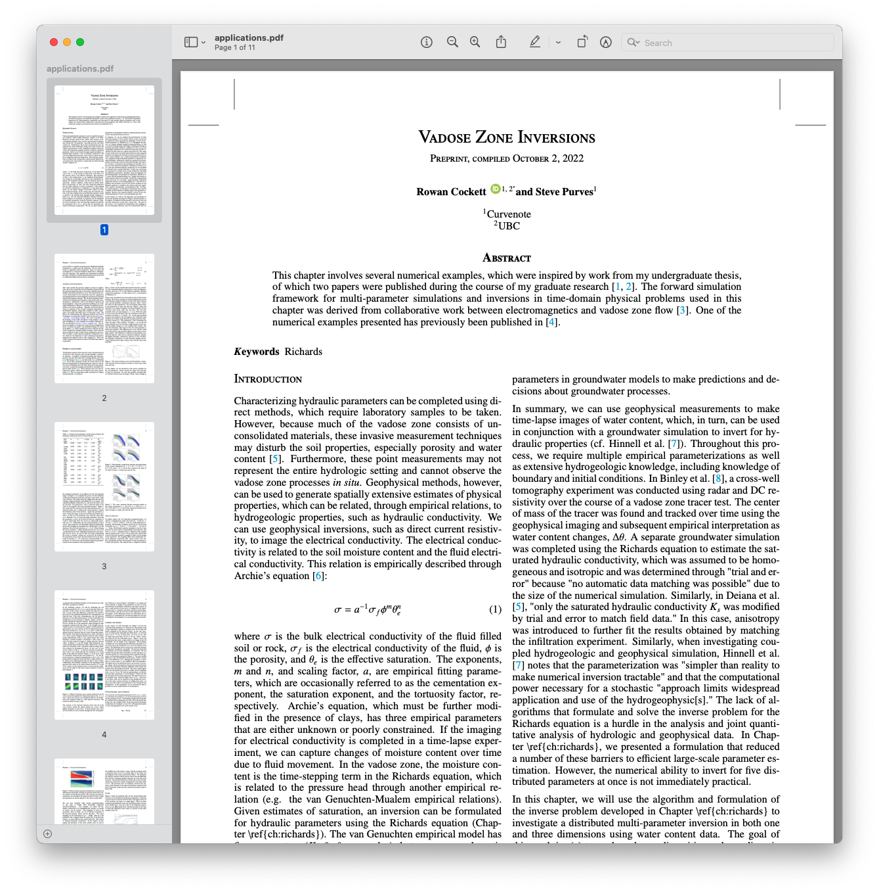

# Geospatial Data Science 🗺

## Background

How did we get here?
Geospatial isn’t only about geographic sciences. But also, about data and information technologies. Especially ever since the introduction of the global navigation satellite system (GNSS). However, both the geospatial and informational were either limited or separated for a long time. GPS technologies accelerated quickly over the past few decades. But it wasn’t an easy pursuit. It dates back to when, in order to satisfy their argument with the English about the shape of the Earth, the French sent out two expeditions to make spatial measurements. 

The French Cassini’s postulated that the Earth was elongated. While Isaac Newton deduced that it was flattened. In 1735 La Condamine and Bouguer went to what was then called Peru -in modern day Ecuador- to perform a measurement on a piece of a meridian. They spent nine years there. Then, in 1736, De Maupertuis spent a year and half in what which was then called Lapland in modern day Finland to do a similar land survey measurement. 

Contrary to what was originally anticipated. The French survey measurements affirmed that the Earth was indeed flattened -as Newton originally anticipated with mathematic and without ever leaving his desk. Those were the early expeditions that initiated Earth measurement sciences as we have them today. 

In 1807 President Thomas Jefferson, who was a surveyor himself, created the Survey of the Coast. Which included geodetic and astronomical survey tools to measure the Earth. Most of these tools were imported from Europe until the 1890s. The Coast Survey conducted monumental work across the U.S. collecting millions of data points on the ground in order to build complex mathematical models of the Earth. This later became the mapping system for the United States. Much of the work that these brave surveyors did over the past few decades laid out the groundwork for the evolution of GPS. In 1960 the U.S. Cost Survey figured out a way to use the Echo 1 satellite for global measurements of the earth. This initiated the development of the global satellite navigation network between 1964-1973. In 1970 the Coast Survey became the National Geodetic Survey (NGS) under NOAA. 

The high costs associated with satellites and mapping systems limited their access to government and military for a long time. But technological and industrial revolutions that have flattened the way over the past few decades lowered their barriers to entry. Anyone today can make geospatial measurements and conduct complex statistical and mathematical methods of the entire world without leaving his or her desk. Just like I'm about to demonstrate for my case study.

I copied all of the above information about the history of geodesy and surveying from video lectures by Dave Doyle, NGS, Chief Geodetic Surveyor (Retired). I included all the links to his awesome video lectures at the end if this page you're interested to learn a ton more.  


Geodatabase Project
The objective of my assignment was to build a geodatabase and provide a useful application/service. I decided to find an open area near where I live to conduct a survey. So, I went to SeaWorld San Diego. What a great place to be. I created a geodatabase and visualized a map that can help both visitors and park management.

I was able to collect seven feature layers. Then I used an imagery web map from Esri with a WGS84 Web Mercator datum and PCS for my base map. Especially since the my map is dependant on GPS. For the geodatabase creation and web maps I used ArcGIS Pro and ArcGIS Online. 

In my case study, I demonstrated the following: concepts of the spatial and temporal aspects of GIS; cartography and symbology; geodatabase design and creation; network data; data collection; and data science and AI applications.

Please note that all of the data included in my project was either publicly collected or fictional for the purposes of demonstration only. 

> The components behind Jupyter Book are downloaded 30,000 times a day, with 750K downloads last month.

The current toolchain used by [JupyterBook] is based on [Sphinx], which is an open-source documentation system used in many software projects, especially in the Python ecosystem. `mystjs` is a similar tool to [Sphinx], however, designed specifically for scientific communication. In addition to building websites, `mystjs` can also help you create scientific PDFs, Microsoft Word documents, and JATS XML (used in scientific publishing).

`mystjs` uses existing, modern web-frameworks in place of the [Sphinx] build system. These tools come out-of-the-box with prefetching for faster navigation, smaller network payloads through modern web-bundlers, image optimization, partial-page refresh through single-page application. Many of these features, performance and accessibility improvements are difficult, if not impossible, to create inside of the [Sphinx] build system.

In 2022, the Executable Books team started work to document the specification behind the markup language, called [myst-spec](https://github.com/jupyter-book/myst-spec), this work has enabled other tools and implementations in the scientific ecosystem to build on MyST (e.g. [scientific authoring tools](https://curvenote.com/for/writing), and [documentation systems](https://blog.readthedocs.com/jupyter-book-read-the-docs/)).

The `mystjs` ecosystem was developed as a collaboration between [Curvenote], [2i2c] and the [ExecutableBooks] team. The initial version of `mystjs` was originally release by [Curvenote] as the [Curvenote CLI](https://curvenote.com/docs/cli) under the MIT license, and transferred to the [ExecutableBooks] team in October 2022. The goal of the project is to enable the same rich content and authoring experiences that [Sphinx] allows for software documentation, with a focus on web-first technologies (Javascript), interactivity, accessibility, scientific references (e.g. DOIs and other persistent IDs), professional PDF outputs, and JATS XML documents for scientific archiving.

## MyST Project

In this paper we introduce `mystjs`, which allows the popular MyST Markdown syntax to be run directly in a web browser, opening up new workflows for components to be used in web-based editors, [directly in Jupyter](https://github.com/jupyter-book/jupyterlab-myst) and in JupyterLite. The libraries work with current MyST Markdown documents/projects and can export to [LaTeX/PDF](https://myst.tools/docs/mystjs/creating-pdf-documents), [Microsoft Word](https://myst.tools/docs/mystjs/creating-word-documents) and [JATS](https://myst.tools/docs/mystjs/creating-jats-xml) as well as multiple website templates using a [modern](https://myst.tools/docs/mystjs/accessibility-and-performance) React-based renderer. There are currently over 400 scientific journals that are supported through [templates](https://github.com/myst-templates), with [new LaTeX templates](https://myst.tools/docs/jtex/create-a-latex-template) that can be added easily using a Jinja-based templating package, called [jtex](https://myst.tools/docs/jtex).

In our paper we will give an overview of the MyST ecosystem, how to use MyST tools in conjunction with existing Jupyter Notebooks, markdown documents, and JupyterBooks to create professional PDFs and interactive websites, books, blogs and scientific articles. We give special attention to the additions around structured data, standards in publishing (e.g. efforts in representing Notebooks as JATS XML), rich [frontmatter](https://myst.tools/docs/mystjs/frontmatter) and bringing [cross-references](https://myst.tools/docs/mystjs/cross-references) and [persistent IDs](https://myst.tools/docs/mystjs/external-references) to life with interactive hover-tooltips ([ORCID, RoR](https://myst.tools/docs/mystjs/frontmatter), [RRIDs](https://myst.tools/docs/mystjs/external-references#research-resource-identifiers), [DOIs](https://myst.tools/docs/mystjs/citations), [intersphinx](https://myst.tools/docs/mystjs/external-references#intersphinx), [wikipedia](https://myst.tools/docs/mystjs/external-references#wikipedia-links), [JATS](https://myst.tools/docs/mystjs/typography), [GitHub code](https://myst.tools/docs/mystjs/external-references#github-links), and more!). This rich metadata and structured content can be used directly to improve science communication both through self-publishing books, blogs, and lab websites — as well as journals that incorporate Jupyter Notebooks.

## Features of MyST

MyST is focused on scientific writing, and ensuring that citations are first class both for writing and for reading (see [](#citations)).

:::{figure} ./images/citations.png
:label: citations
Citations are rendered with a popup directly inline.
:::

MyST aims to show as much information in context as possible, for example, [](#equations) shows a reading experience for a referenced equation: you can immediately **click on the reference**, see the equation, all without losing any context -- ultimately saving you time. [](doi:10.1145/3411764.3445648) found that these ideas both improved the overall reading experience of articles as well as allowed researchers to answer questions about an article **26% faster** when compared to a traditional PDF!

:::{figure} ./images/equations.gif
:label: equations
In context cross-references improve the reading experience.
:::

One of the important underlying goals of practicing reproducibility, sharing more of the methods and data behind a scientific work so that other researchers can both verify as well as build upon your findings. One of the exciting ways to pull for reproducibility is to make documents directly linked to data and computation! In [](#interactive), we are showing outputs from a Jupyter Notebook directly part of the published scientific narrative.

:::{figure} ./images/interactive.gif
:label: interactive
Embedding data, interactivity and computation into a MyST article.
:::

To drive all of these features, the contents of a MyST document needs to be well defined. This is critical for powering interactive hovers, linked citations, and compatibility with scientific publishing standards like the Journal Article Metadata Tag Suite (JATS). We have an emerging specification for MyST, [`myst-spec`](https://spec.myst.tools), that aims to capture this information and transform it between many different formats, like PDF, Word, JSON, and JATS XML ([](#structured-data)). This specification is arrived at through a community-centric MyST Enhancement Proposal ([MEP](https://compass.executablebooks.org/en/latest/meps.html)) process.

:::{figure} ./images/structured-data.gif
:label: structured-data
The data behind MyST is **structured**, which means we can transform it into many different document types and use it to power all sorts of exciting features!
:::

One of the common forms of scientific communication today is through PDF documents. MyST has excellent support for creating PDF documents, using a data-driven templating library called `jtex`. The document in Figure 5 was created using MyST!


**Figure 5**: A PDF rendering through MyST.

## Map demo

```{code-cell}
import leafmap.foliumap as leafmap
import geopandas as gpd

url = "https://github.com/mohamadyassin/myst_airc/releases/download/data/FoodandBeverage.geojson"
m = leafmap.Map(center=[32.7658, -117.2264], zoom=17)
point_style = {
    "radius": 5,
    "color": "red",
    "fillOpacity": 0.8,
    "fillColor": "blue",
    "weight": 3,
}
hover_style = {"fillColor": "yellow", "fillOpacity": 1.0}
m.add_geojson(
    url, point_style=point_style, hover_style=hover_style, layer_name="FnB"
)

m
```

## Code blocks

```{code}
:linenos:
:emphasize-lines: 3,4

import leafmap.foliumap as leafmap

m = leafmap.Map(center=[40, -100], zoom=4)
m
```

## Conclusion

There are many opportunities to improve open-science communication, to make it more interactive, accessible, more reproducible, and both produce and use structured data throughout the research-writing process. The `mystjs` ecosystem of tools is designed with structured data at its core. We would love if you gave it a try -- learn to get started at <https://myst.tools>.

[2i2c]: https://2i2c.org/
[curvenote]: https://curvenote.com
[docutils]: https://docutils.sourceforge.io/
[executablebooks]: https://executablebooks.org/
[jupyterbook]: https://jupyterbook.org/
[jupyterlab-myst]: https://github.com/jupyter-book/jupyterlab-myst
[sphinx]: https://www.sphinx-doc.org/

```

```
